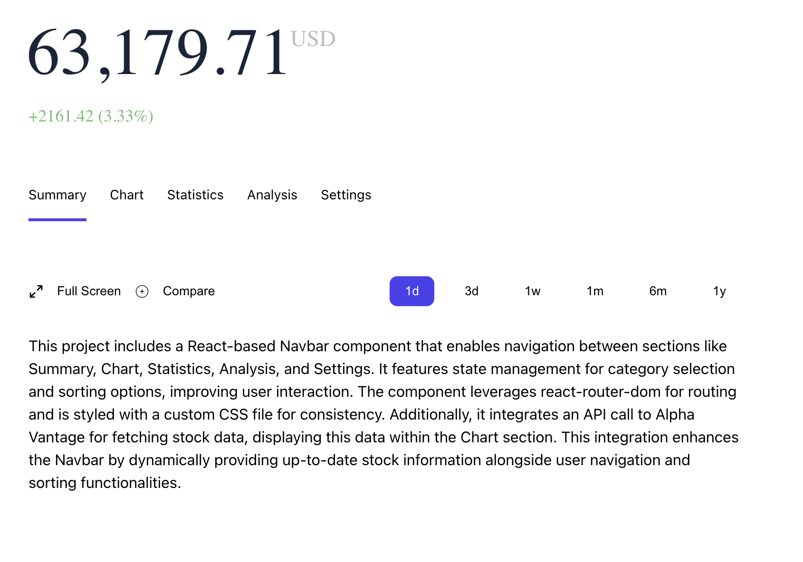
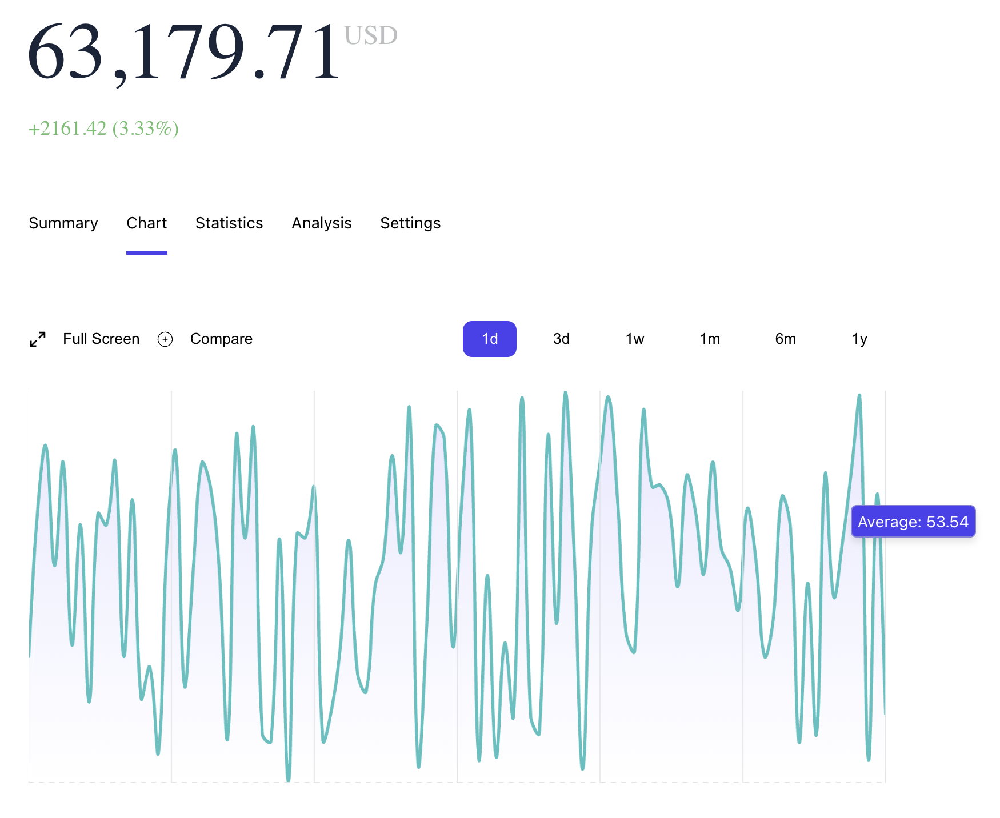
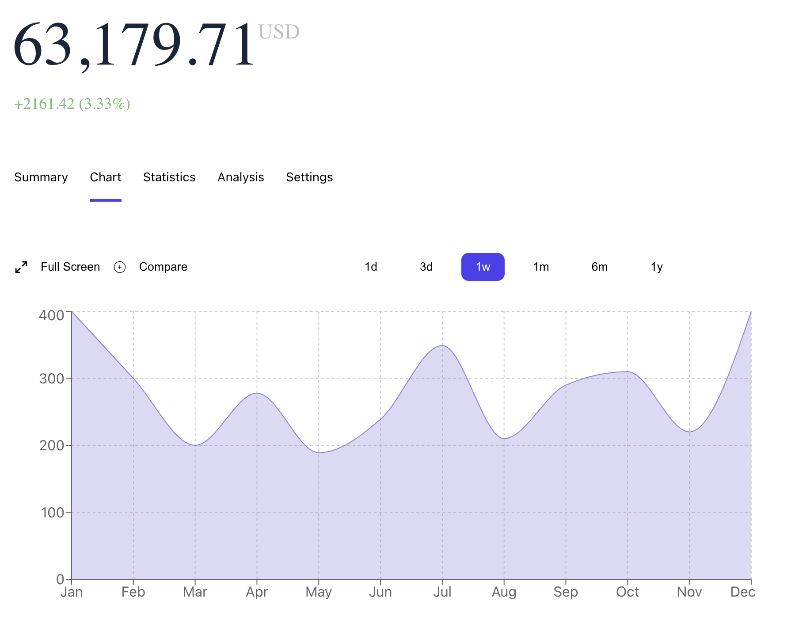
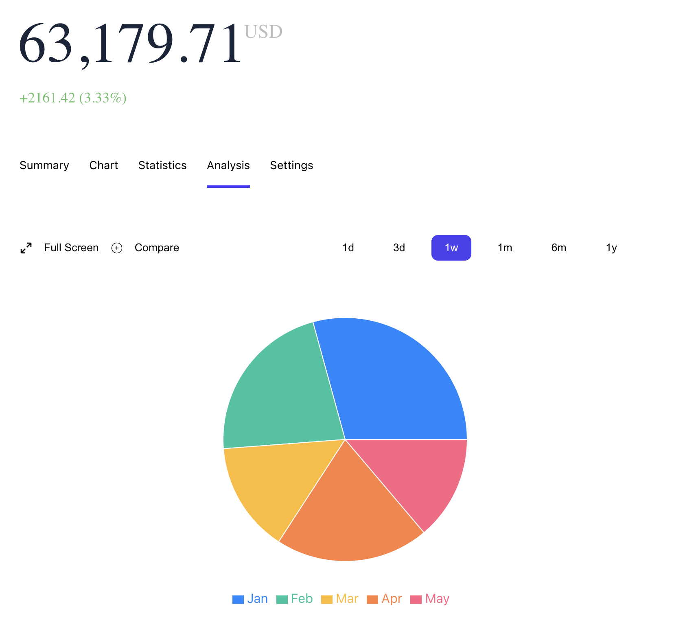
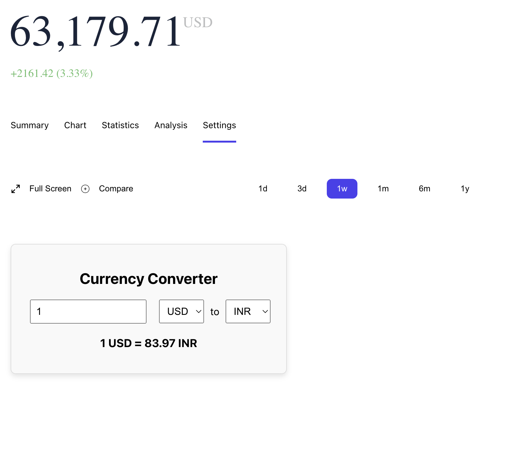

# Stock_Dashboard

## 📌 Introduction

[](https://awesome.re)

A React component for a stock dashboard that visualizes data using an area chart from recharts, fetching real-time stock data from NASA's Open API. It features dynamic data integration, custom tooltips, and responsive design to enhance stock data visualization.

## 🚀 View Live Demo


<pre><center><a href="https://stock-dashboard-tau.vercel.app"><b>https://stock-dashboard-tau.vercel.app</b></a></center></pre>

## 🛠️ Installation Steps

Star and Fork the Repo 🌟 and this will keep us motivated.

1. Clone the repository

```bash
git clone https://github.com/subhashdippu/StockDashboard.git
```

2. Change the working directory

```bash
cd StockDashboard
```

3. Install dependencies

```bash
npm install
```

4. Run the app

```bash
npm run start
```

## 📸 Screenshots






